# 🛠️ AuraMail Setup Guide

> **Complete step-by-step setup instructions**  
> Get AuraMail running with Gmail API integration in minutes.

---

## 🚀 Quick Setup Overview

1. **Run Setup Command** → `python setup.py`
2. **Configure Google Cloud** → Enable Gmail API & create credentials
3. **Download Credentials** → Get `credentials.json` file
4. **Complete OAuth** → Authorize AuraMail access
5. **Add API Keys** → OpenAI API key and email configuration
6. **Launch Application** → Start using AuraMail!

---

## 📋 Step-by-Step Instructions

### 1️⃣ **Initial Setup Command**

Run the setup script in your terminal:
```bash
python setup.py
```

You'll see this welcome message:
```
=== AuraMail setup ===

No credentials.json found in app folder.
I can open the Google Cloud Console page where you can create OAuth credentials for a Desktop app.
Would you like me to open that page in your browser now? [Y/n]
```

**Press `Y` and hit Enter** - this will open Google Cloud Console in your browser.

---

### 2️⃣ **Google Cloud Console Configuration**

#### 🆕 **First-Time Google Cloud Users**

If this is your first time using Google Cloud Console (Toggle `Configure OAuth Consent Screen` below):

<details>
<summary><strong>📱 Configure OAuth Consent Screen</strong></summary>

1. **Navigate to OAuth consent screen**
   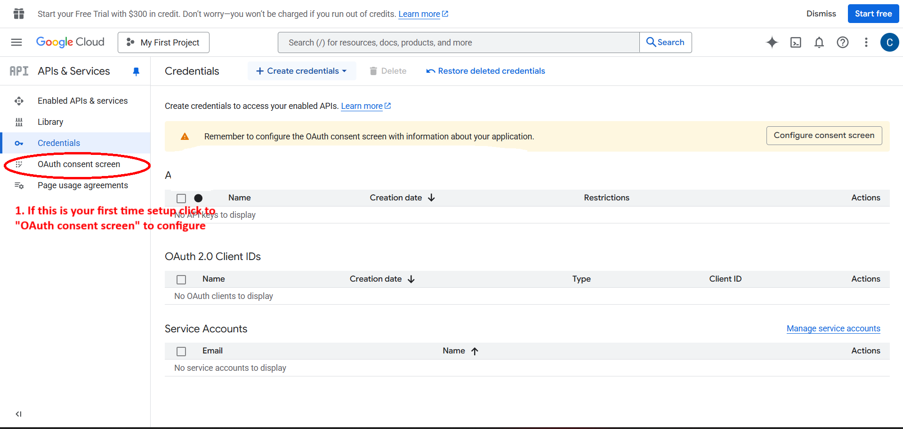

2. **Select External audience type**
   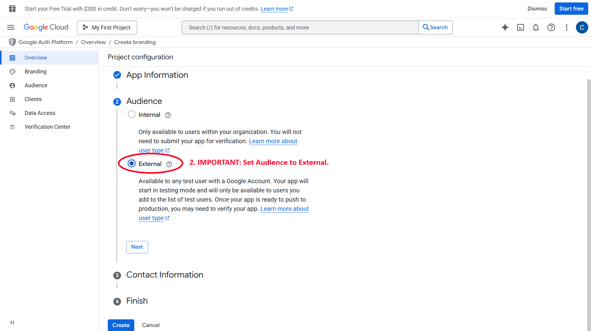
   
   > 💡 **Why External?** This allows any Gmail user to use your application

3. **Fill in application details**
   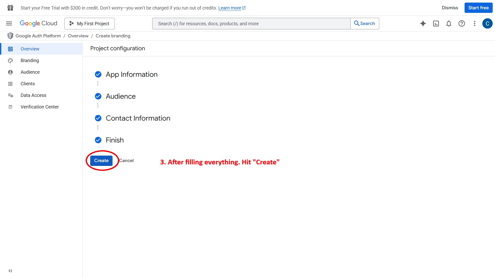
   
   **Required fields:**
   - **App name**: `AuraMail` (or your preferred name)
   - **User support email**: Your email address
   - **Developer contact**: Your email address

4. **Publish the app**
   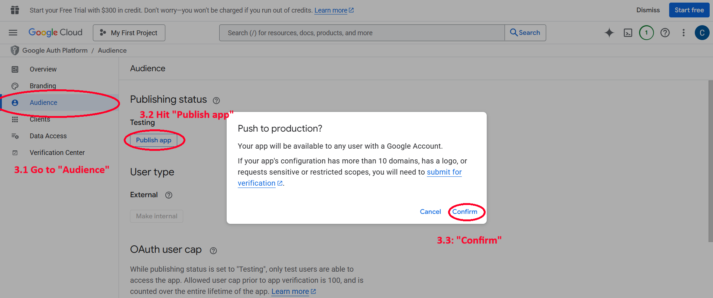
   - Go to **"Publish app"**
   - Click **"Confirm"** to make it available
  
   
   
   **You also have to Enable Gmail API**
    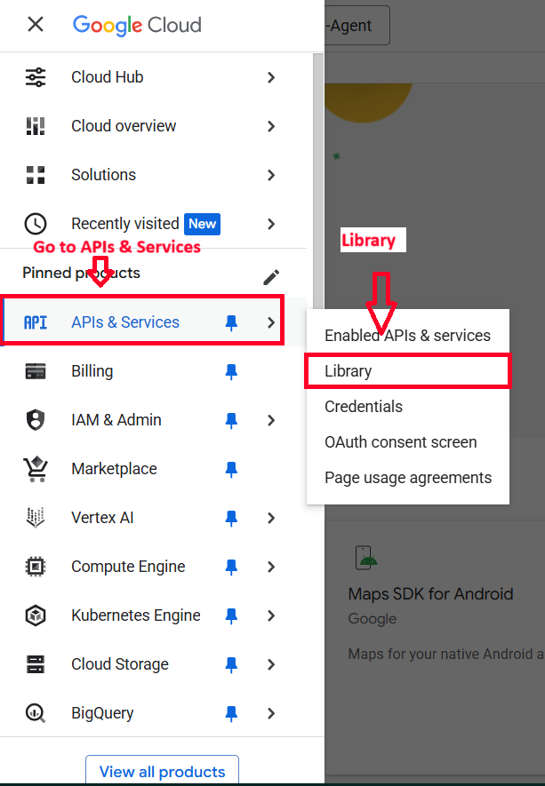
    
    Search for GmailAPI
    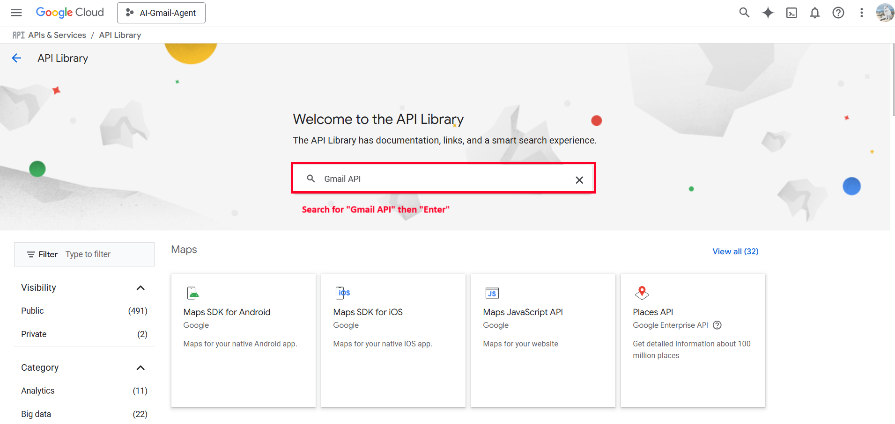
    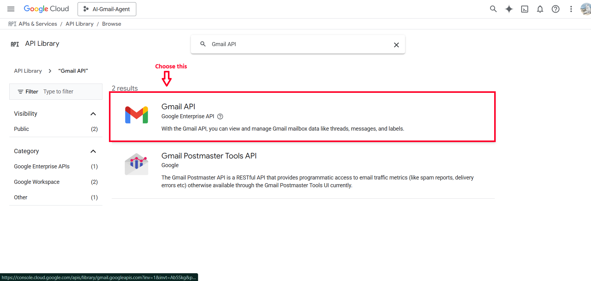

    **Enable it**
    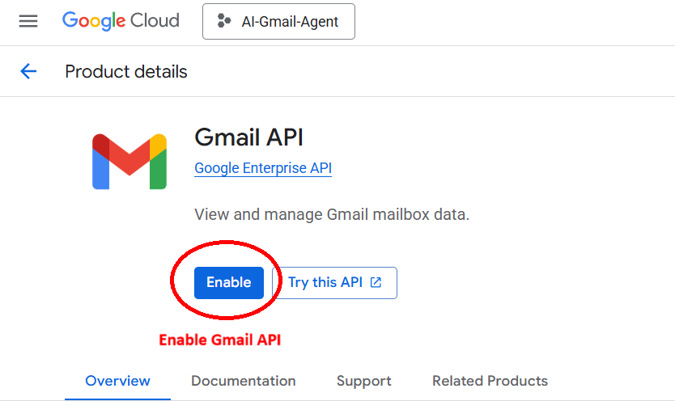


</details>

---

#### 🔑 **Create OAuth Credentials**

5. **Create OAuth Client**
   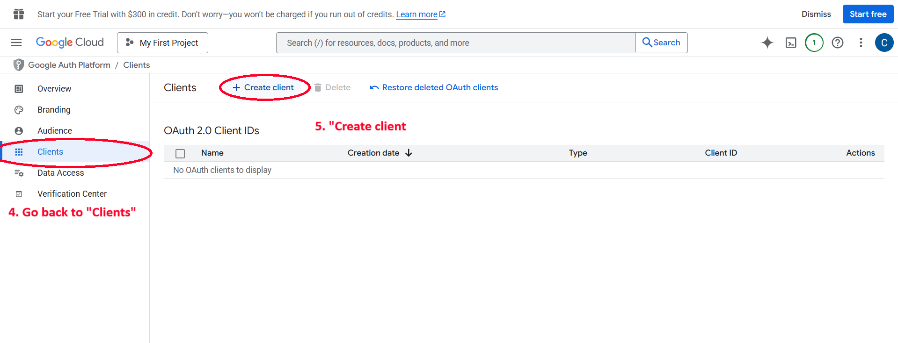
   - Navigate to **"Credentials"** tab
   - Click **"+ CREATE CREDENTIALS"**
   - Select **"OAuth client ID"**

6. **Choose Desktop Application**
   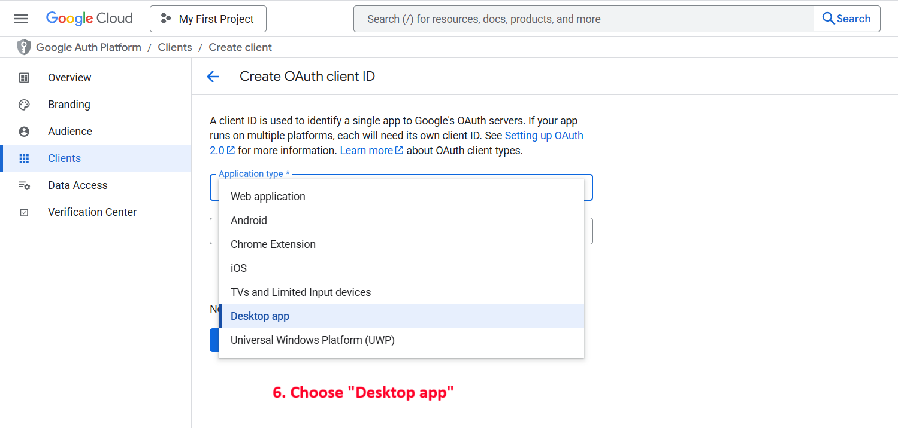
   - Application type: **"Desktop application"**
   - Name: `AuraMail Desktop` (or your choice)

7. **Download credentials**
   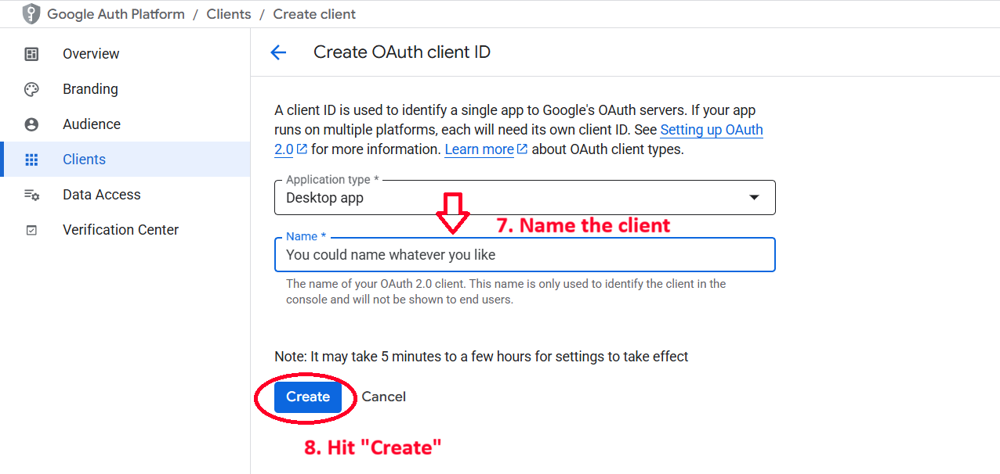
   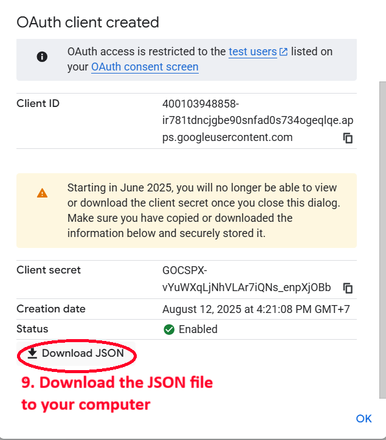
   - Click **"CREATE"**
   - Download the JSON file when prompted
   - **Remember the download location!**

---

### 3️⃣ **Complete Local Setup**

8. **Return to terminal**
   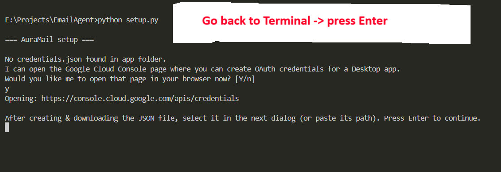
   - Go back to your terminal
   - **Press Enter** to continue

9. **Select credentials file**
   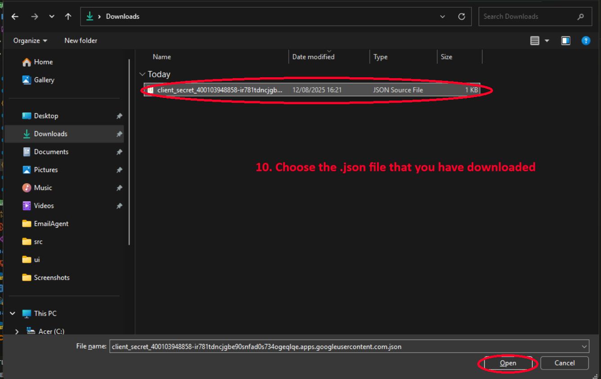
   - File dialog will open
   - Navigate to your **Downloads** folder
   - Select the `.json` file you downloaded
   - Click **"Open"**

---

### 4️⃣ **OAuth Authorization Flow**

10. **Authorize AuraMail**
    
    Your browser will open with Google's authorization page:
    
    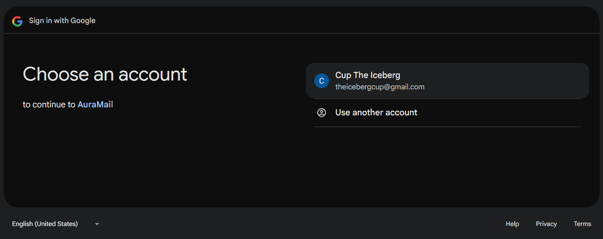
    - **Sign in** to your Gmail account
    
    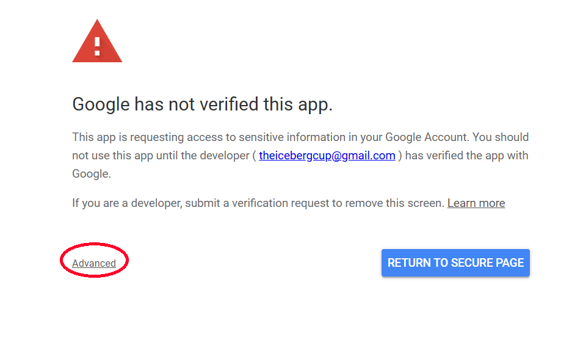
    - **Select your account** if multiple accounts shown
    
    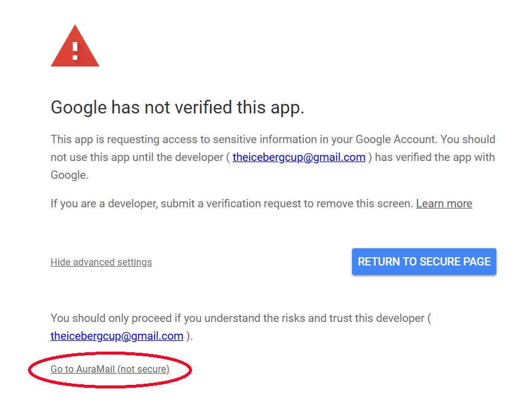
    - Click **"Advanced"** if you see a warning
    - Click **"Go to AuraMail (unsafe)"** - this is normal for development apps
    
    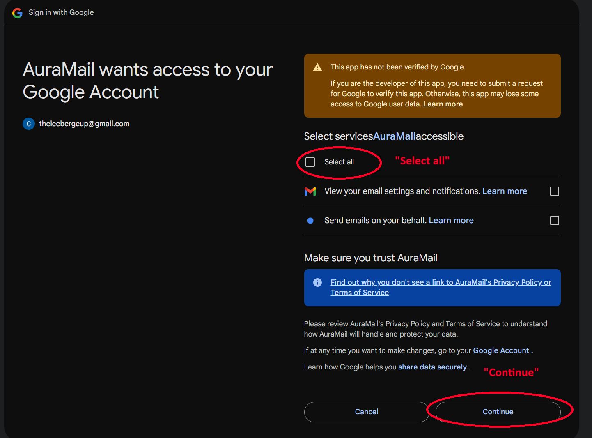
    - **Review permissions** carefully:
      - ✅ Read your email messages and settings
      - ✅ Send email on your behalf
    - Click **"Allow"**

---

### 5️⃣ **Final Configuration**

11. **Add API Keys**
    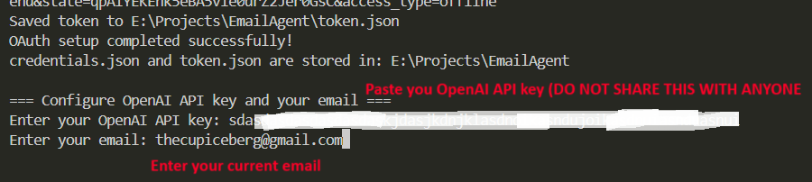
    
    Back in the terminal, you'll be prompted for:
    
    **OpenAI API Key:**
    ```
    Enter your OpenAI API key: sk-...
    ```
    
    > 🔗 **Need an OpenAI API key?** Watch this [setup video](https://www.youtube.com/watch?v=SzPE_AE0eEo)
    
    **Your Email Address:**
    ```
    Enter your email: your-email@gmail.com
    ```

---

## ✅ Setup Complete!

After completing all steps, you should see:
```
✓ OAuth setup completed successfully!
✓ credentials.json and token.json are stored in: [app directory]
✓ .env file updated with API key and email
✓ Setup finished!
```

---

## 🎯 What Happens During Setup?

| Step | What It Does | Files Created |
|------|--------------|---------------|
| **OAuth Flow** | Authorizes AuraMail to access Gmail | `token.json` |
| **Credentials** | Stores Google API credentials | `credentials.json` |
| **Environment** | Saves API keys and email | `.env` |

---

## 🔧 Troubleshooting Setup

### Common Issues & Solutions

<details>
<summary><strong>🚫 "App not verified" warning</strong></summary>

**This is normal!** Since you created the app yourself:
1. Click **"Advanced"**
2. Click **"Go to [Your App Name] (unsafe)"**
3. This warning appears for all self-created apps

</details>

<details>
<summary><strong>🔑 Invalid credentials error</strong></summary>

**Solution:**
1. Make sure you downloaded the **correct JSON file**
2. Verify you selected **"Desktop application"** type
3. Try creating new credentials if issues persist

</details>

<details>
<summary><strong>📧 Gmail API not enabled</strong></summary>

**Solution:**
1. Go to [Gmail API Library](https://console.cloud.google.com/apis/library/gmail.googleapis.com)
2. Click **"ENABLE"**
3. Return to credentials setup

</details>

<details>
<summary><strong>🔒 Permission denied errors</strong></summary>

**Solution:**
1. Ensure you granted **both permissions**:
   - Read email messages and settings
   - Send email on your behalf
2. Revoke and re-authorize if needed

</details>

---

## 🔐 Security Notes

### 🛡️ **What AuraMail Can Access**

| Permission | Purpose | Data Usage |
|------------|---------|-------------|
| **📖 Read Emails** | Monitor inbox for new messages | Local processing only* |
| **📤 Send Emails** | Send your approved responses | Direct Gmail API calls |

> *Email content is sent to OpenAI for AI processing (classification, summarization, responses)

### 🔒 **Your Data Safety**

- ✅ **Credentials stored locally** - never sent to external servers
- ✅ **OAuth tokens encrypted** - secure authentication
- ✅ **No data collection** - AuraMail doesn't store your emails remotely
- ✅ **Revoke access anytime** - through Google Account settings

---

## 🆘 Need Help?

### 📞 **Support Options**

| Issue Type | Contact Method |
|------------|----------------|
| **🐛 Setup Problems** | [GitHub Issues](https://github.com/harrydawitch/AuraMail/issues) |
| **❓ General Questions** | tl376284@gmail.com |
| **📖 Documentation** | [Main README](./README.md) |

### 🔄 **Re-running Setup**

If you need to setup again:
```bash
# Remove existing files
rm credentials.json token.json .env

# Run setup again
python setup.py
```

---

## ▶️ **Next Steps**

Once setup is complete:

1. **🚀 Launch AuraMail**
   ```bash
   # Double-click the launcher
   ./AuraMail.vbs
   
   # Or run directly
   python main.py
   ```

2. **🎯 Test the application**
   - Send yourself a test email
   - Watch AuraMail classify and process it
   - Try generating a response

3. **⚙️ Customize settings**
   - Adjust classification rules in `src/prompts.py`
   - Modify check interval in `main.py`
   - Personalize the interface

---

<div align="center">

**🎉 Congratulations! AuraMail is ready to use.**

[🏠 Back to README](./README.md) | [🐛 Report Issues](https://github.com/harrydawitch/AuraMail/issues) | [⭐ Star Project](https://github.com/harrydawitch/AuraMail)

</div>